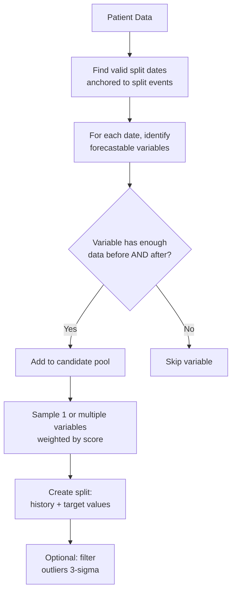
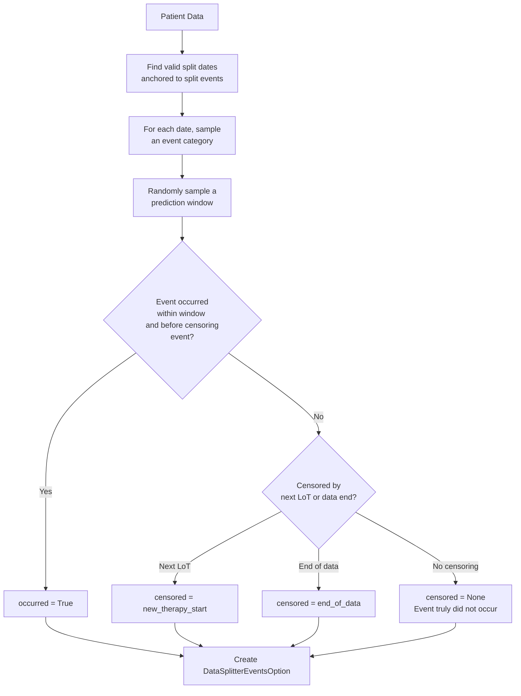

# Data Splitting

Data splitting is the process of dividing a patient's longitudinal timeline into **input** (history) and **target** (future) segments. Each split produces a training example for the LLM: the history becomes the prompt context, and the target becomes the expected completion.

TwinWeaver provides specialized splitters for two complementary clinical prediction tasks:

| Splitter | Task | Example |
|----------|------|---------|
| `DataSplitterForecasting` | Forecasting continuous or categorical variables | Predict hemoglobin values over the next 90 days |
| `DataSplitterEvents` | Landmark event prediction (time-to-event) | Did the patient progress within 52 weeks? |

A unified `DataSplitter` interface combines both, ensuring they share the same split dates for multi-task training.

---

## Core Concept: Split Dates

Every split revolves around a **split date** — the moment in time that separates what the model can see (input) from what it must predict (target).

```
Patient timeline
──────────────────────────────────────────────────────►  time

  LoT Start            Split Date           Forecast Horizon
     │                     │                       │
     ▼                     ▼                       ▼
        INPUT (history)    │  TARGET (future)      │
        events ≤ split     │  events > split       │
```

### How Split Dates Are Chosen

Split dates are anchored to **split events** — a configurable event category (typically Line of Therapy, `"lot"`). The framework:

1. **Finds all split-event start dates** in the patient's history (e.g., every LoT start).
2. **Identifies candidate dates** within a window around each split event (controlled by `max_split_length_after_split_event`, default 90 days).
3. **Randomly samples** one or more candidate dates per split event (`max_num_splits_per_split_event`).

This anchoring ensures that training examples are centered on clinically meaningful time points rather than arbitrary dates.

!!! tip "Configuration"
    ```python
    config.split_event_category = "lot"  # Anchor splits to Line of Therapy starts
    ```

---

## Forecasting Splits

The `DataSplitterForecasting` generates tasks where the model must predict future values of specific variables (e.g., lab results, biomarker levels).

### How It Works



For each candidate split date, the forecasting splitter:

1. **Checks variable eligibility**: A variable is valid at a given date only if it has at least `min_nr_variable_seen_previously` occurrences in the lookback window and `min_nr_variable_seen_after` occurrences in the forecast window.
2. **Samples variables**: Between `min_nr_variables_to_sample` and `max_nr_variables_to_sample` variables are selected per task, using weighted proportional sampling based on pre-computed statistics (optionally uniform sampling).
3. **Creates the split**: Events before the split date form the input; future values of the sampled variables (within `max_forecast_time_for_value`) form the target.
4. **Filters future LoT overlap**: Target events occurring after the next Line of Therapy start are excluded to avoid data leakage.

### Variable Statistics & Sampling

Before generating splits, calling `setup_statistics()` computes a baseline predictability score for each variable using a simple **copy-forward** strategy (predicting the next value as the previous one). The computed metrics include:

| Metric | Description |
|--------|-------------|
| R² | Coefficient of determination for the copy-forward baseline |
| NRMSE | Normalized Root Mean Squared Error |
| MAPE | Mean Absolute Percentage Error |
| `score_log_nrmse_n_samples` | Combined score used for weighted sampling (default) |

Variables with higher variability (harder to predict with copy-forward) receive higher sampling weights, encouraging the model to focus on learning patterns for more dynamic biomarkers. Categorical variables are sampled uniformly using the mean score of numeric variables.

!!! note "Numeric vs. Categorical Variables"
    TwinWeaver automatically detects variable types via `DataManager.infer_var_types()`. Numeric variables get full statistical analysis; categorical variables receive placeholder statistics and uniform sampling weights.

### Outlier Filtering

When `filter_outliers=True`, the **3-sigma strategy** clips target values to the $[\mu - 3\sigma, \mu + 3\sigma]$ range based on training-set statistics. This prevents extreme outliers from dominating the training signal.

### Key Parameters

```python
data_splitter_forecasting = DataSplitterForecasting(
    data_manager=dm,
    config=config,
    max_split_length_after_split_event=pd.Timedelta(days=90),  # Window after split event
    max_lookback_time_for_value=pd.Timedelta(days=90),          # Lookback for variable history
    max_forecast_time_for_value=pd.Timedelta(days=90),          # Forecast horizon
    min_nr_variable_seen_previously=1,                          # Min past occurrences
    min_nr_variable_seen_after=1,                               # Min future occurrences
    min_nr_variables_to_sample=1,                               # Min variables per task
    max_nr_variables_to_sample=3,                               # Max variables per task
    filtering_strategy="3-sigma",                               # Outlier handling
    sampling_strategy="proportional",                           # Weighted or uniform sampling
)
```

---

## Event Prediction Splits

The `DataSplitterEvents` generates **landmark event prediction** tasks — predicting whether a discrete clinical event (e.g., death, disease progression) occurs within a randomly sampled future time window.

### How It Works



For each candidate split date, the event splitter:

1. **Samples an event category** from the configured mapping (e.g., `"death"` or `"progression"`), avoiding duplicate categories per split.
2. **Samples a prediction window** of random duration between `min_length_to_sample` (default: 1 week) and `max_length_to_sample` (default: 104 weeks). This trains the model to handle variable-length horizons.
3. **Determines the outcome**:
    - **Occurred**: The event was observed within the window before any censoring events.
    - **Censored**: The observation was cut short by a new therapy start, end of data, or a data cutoff date.
    - **Not occurred**: The event genuinely did not happen within the window (e.g., the patient is known to be alive at the end of the window).
4. **Handles backup categories**: If the exact event category is absent, the splitter can fall back to a backup (e.g., using `"death"` as a proxy for `"progression"` events).

### Key Parameters

```python
data_splitter_events = DataSplitterEvents(
    data_manager=dm,
    config=config,
    max_length_to_sample=pd.Timedelta(weeks=104),               # Max prediction window
    min_length_to_sample=pd.Timedelta(weeks=1),                  # Min prediction window
    unit_length_to_sample="weeks",                               # Window sampling unit
    max_split_length_after_split_event=pd.Timedelta(days=90),    # Window after split event
)
```

### Configuration

The event-to-prediction mapping is configured via:

```python
config.data_splitter_events_variables_category_mapping = {
    "death": "death",                  # event_category → descriptive name in prompt
    "progression": "next progression", # custom prompt label
}
```

---

## Combined Splitting with `DataSplitter`

The `DataSplitter` class provides a unified interface that coordinates both splitters. This is the **recommended approach** for generating multi-task training data, as it ensures forecasting and event prediction tasks share the same split dates.

### Training Workflow

```python
from twinweaver import DataSplitter

data_splitter = DataSplitter(data_splitter_events, data_splitter_forecasting)

# Generate aligned splits for both tasks
forecasting_splits, events_splits, reference_dates = \
    data_splitter.get_splits_from_patient_with_target(patient_data)
```

Internally, `get_splits_from_patient_with_target`:

1. Calls `DataSplitterForecasting.get_splits_from_patient()` to determine split dates and generate forecasting tasks.
2. Passes those same split dates (`reference_dates`) to `DataSplitterEvents.get_splits_from_patient()` to generate aligned event prediction tasks.

This alignment is critical: both task types see the same patient history up to the same point in time, enabling consistent multi-task learning.

### Inference Workflow

For inference, use `get_splits_from_patient_inference`, which anchors the split at the **last available date** in the patient's record:

```python
forecast_split, events_split = data_splitter.get_splits_from_patient_inference(
    patient_data,
    inference_type="both",  # "forecasting", "events", or "both"
    forecasting_override_variables_to_predict=["HGB", "WBC"],
    events_override_category="death",
    events_override_observation_time_delta=pd.Timedelta(weeks=52),
)
```

---

## How Multiple Training Examples Are Generated

A single patient can yield many training examples through several sources of variation:

| Source of Variation | Controlled By | Effect |
|---------------------|---------------|--------|
| Multiple split events (e.g., LoTs) | Patient history | One split per LoT by default |
| Multiple dates per split event | `max_num_splits_per_split_event` | Random dates within the LoT window |
| Different variable subsets | `min/max_nr_variables_to_sample` | Different forecasting questions per date |
| Different event categories | `data_splitter_events_variables_category_mapping` | Death vs. progression predictions |
| Different prediction windows | `min/max_length_to_sample` | 1-week to 104-week horizons |

This diversity encourages the model to generalize across time points, variables, and prediction tasks.

---

## End-to-End Example

```python
import pandas as pd
from twinweaver import (
    DataManager, Config,
    DataSplitterForecasting, DataSplitterEvents,
    DataSplitter, ConverterInstruction,
)

# 1. Configure
config = Config()
config.split_event_category = "lot"
config.event_category_forecast = ["lab"]
config.data_splitter_events_variables_category_mapping = {
    "death": "death",
    "progression": "next progression",
}

# 2. Load and process data
dm = DataManager(config=config)
dm.load_indication_data(df_events=df_events, df_constant=df_constant,
                        df_constant_description=df_constant_description)
dm.process_indication_data()
dm.setup_unique_mapping_of_events()
dm.setup_dataset_splits()
dm.infer_var_types()

# 3. Initialize splitters
data_splitter_events = DataSplitterEvents(dm, config=config)
data_splitter_events.setup_variables()

data_splitter_forecasting = DataSplitterForecasting(data_manager=dm, config=config)
data_splitter_forecasting.setup_statistics()  # Compute variable scores

data_splitter = DataSplitter(data_splitter_events, data_splitter_forecasting)

# 4. Generate splits for a patient
patient_data = dm.get_patient_data(dm.all_patientids[0])
forecasting_splits, events_splits, reference_dates = \
    data_splitter.get_splits_from_patient_with_target(patient_data)

# 5. Convert to text
converter = ConverterInstruction(
    nr_tokens_budget_total=8192, config=config, dm=dm,
    variable_stats=data_splitter_forecasting.variable_stats,
)

result = converter.forward_conversion(
    forecasting_splits=forecasting_splits[0],
    event_splits=events_splits[0],
    override_mode_to_select_forecasting="both",
)

print(result["instruction"][:500])
print(result["answer"])
```

---

## What's Next?

- **[Dataset Format](dataset-format.md)**: Understand the expected input data structure
- **[Framework Overview](framework.md)**: Learn about TwinWeaver's architecture and task types
- **[Data Preparation Tutorial](examples/01_data_preparation_for_training.ipynb)**: Step-by-step notebook walkthrough
- **[Custom Splitting (Training)](examples/advanced/custom_splitting/training_individual_splitters.ipynb)**: Advanced splitting with individual splitters
- **[API Reference — Data Splitters](reference/instruction/data_splitters.md)**: Full API documentation
