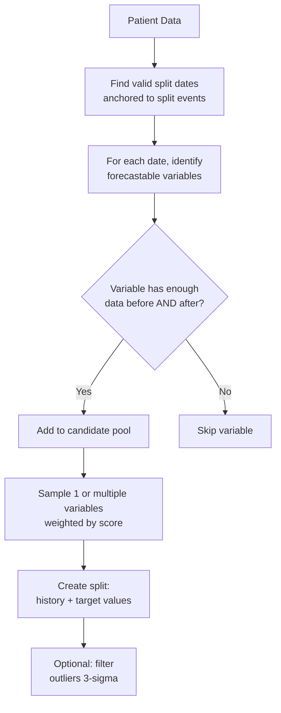
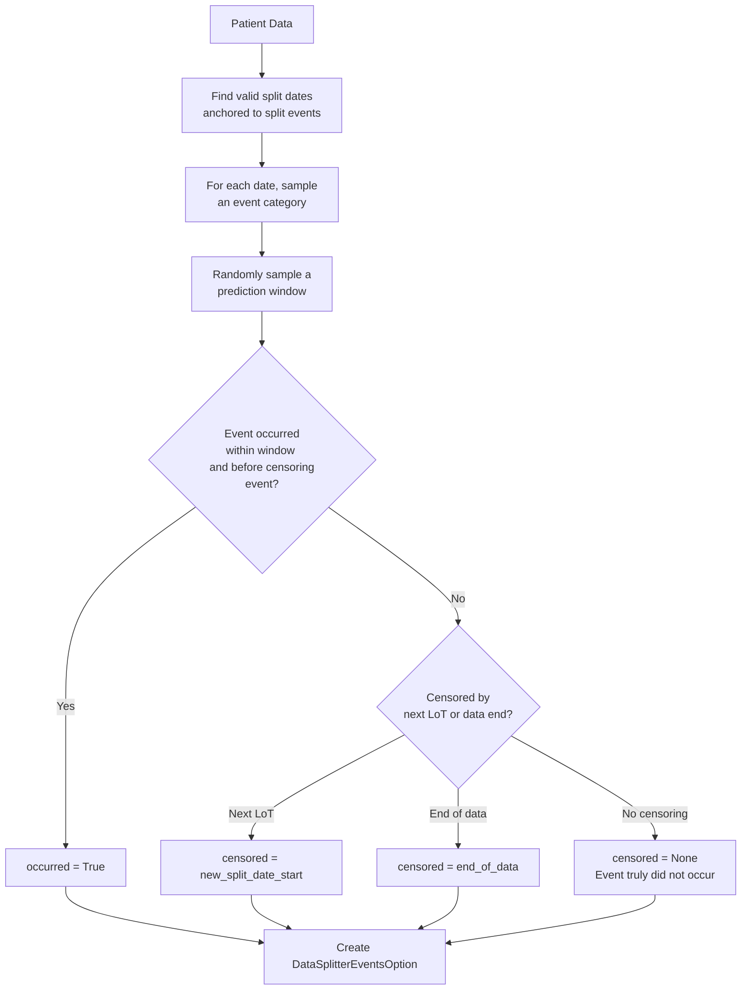

# Data Splitting

Data splitting is the process of dividing a patient's longitudinal timeline into **input** (history) and **target** (future) segments. Each split produces a training example for the LLM: the history becomes the prompt context, and the target becomes the expected completion.

TwinWeaver provides specialized splitters for two complementary clinical prediction tasks:

| Splitter | Task | Example |
|----------|------|---------|
| `DataSplitterForecasting` | Forecasting continuous or categorical variables | Predict hemoglobin values over the next 90 days |
| `DataSplitterEvents` | Landmark event prediction (time-to-event) | Did the patient progress within 52 weeks? |

A unified `DataSplitter` interface combines one or both splitters into a single entry point. When both are supplied, it ensures they share the same split dates for multi-task training. Either splitter can also be used individually.

---

## Core Concept: Split Dates

Every split revolves around a **split date** — the moment in time that separates what the model can see (input) from what it must predict (target).

```
Patient timeline
──────────────────────────────────────────────────────►  time

  LoT Start            Split Date           Forecast Horizon
     │                     │                       │
     ▼                     ▼                       ▼
        INPUT (history)    │  TARGET (future)      │
        events ≤ split     │  events > split       │
```

### How Split Dates Are Chosen

Split dates are anchored to **split events** — a configurable event category (typically Line of Therapy, `"lot"`). The framework:

1. **Finds all split-event start dates** in the patient's history (e.g., every LoT start).
2. **Identifies candidate dates** within a window around each split event (controlled by `max_split_length_after_split_event`, default 0 days).
3. **Optionally applies a gate**: with `no_split_before_events`, candidate dates before an index event (e.g., treatment start) are discarded — see [Gating splits on an event](#gating-splits-on-an-event).
4. **Randomly samples** up to `max_num_splits_per_split_event` candidate dates per split event, **without replacement** — the same date is never returned twice, and if a split event has fewer candidates than requested, all of them are used. The draw is seeded from `Config.seed` — see [Reproducibility and seeding](#reproducibility-and-seeding).

This anchoring ensures that training examples are centered on clinically meaningful time points rather than arbitrary dates.

!!! tip "Configuration"
    ```python
    config.split_event_category = "lot"  # Anchor splits to Line of Therapy starts
    ```

### Gating Splits on an Event

Some studies have an index event — treatment start, enrolment, first dose — before which a split makes no clinical sense. `no_split_before_events` restricts every split date to be **on or after** the earliest such event:

```python
data_splitter_forecasting = DataSplitterForecasting(
    ...,
    no_split_before_events=["treatment"],   # or ["tx_start"], or a mix of both
)
```

Each entry is matched against **both** `config.event_category_col` and `config.event_name_col`, so the gate can be given as an event category (e.g. `"lot"`) or as a specific event name (e.g. `"tx_start"`).

!!! warning "Patients without the gate event"
    A patient who never has any of the listed events yields **no splits at all** — every split has to be anchored after the gate, so such a patient cannot contribute one. `DataSplitterForecasting.get_splits_from_patient` returns `[None]` for them and logs an info message.

The parameter is available on **both** splitters (it lives on `BaseDataSplitter`), so pass the same value to each when you use them together, keeping their split dates aligned:

```python
data_splitter_events = DataSplitterEvents(..., no_split_before_events=["treatment"])
```

### Reproducibility and Seeding

Split-date sampling uses the global NumPy random stream, which `Config` seeds from `Config.seed`:

```python
config.seed = 1234   # re-seeds numpy and random immediately
```

Changing the seed changes which candidate dates are drawn, and re-running with the same seed reproduces them. Each patient advances the stream, so different patients get different relative split positions.

To decouple split-date sampling from the global stream (e.g. when other code consumes random numbers in between), pass an explicit `random_state`:

```python
data_splitter_forecasting = DataSplitterForecasting(..., random_state=1234)
```

It accepts an `int`, a `numpy.random.Generator`, or a `numpy.random.RandomState`.

---

## Forecasting Splits

The `DataSplitterForecasting` generates tasks where the model must predict future values of specific variables (e.g., lab results, biomarker levels).

### How It Works


```mermaid
flowchart TD
    A[Patient Data] --> B[Find valid split dates<br>anchored to split events]
    B --> C[For each date, identify<br>forecastable variables]
    C --> D{Variable has enough<br>data before AND after?}
    D -->|Yes| E[Add to candidate pool]
    D -->|No| F[Skip variable]
    E --> G[Sample 1 or multiple variables<br>weighted by score]
    G --> H[Create split:<br>history + target values]
    H --> I[Optional: filter<br>outliers 3-sigma]
```

For each candidate split date, the forecasting splitter:

1. **Checks variable eligibility**: A variable is valid at a given date only if it has at least `min_nr_variable_seen_previously` occurrences in the lookback window, `min_nr_variable_seen_after` occurrences in the forecast window, and — when `min_total_horizon` is set — at least one occurrence at or beyond that horizon.
2. **Samples variables**: Between `min_nr_variables_to_sample` and `max_nr_variables_to_sample` variables are selected per task (both bounds inclusive), using weighted proportional sampling based on pre-computed statistics (optionally uniform sampling).
3. **Creates the split**: Events before the split date form the input; future values of the sampled variables (within `max_forecasted_trajectory_length`) form the target.
4. **Filters future LoT overlap**: Target events occurring after the next Line of Therapy start are excluded to avoid data leakage.
5. **Re-checks the horizon**: If truncation or outlier filtering shortened the target below `min_total_horizon`, the split is discarded and another candidate date is tried.

### Variable Statistics & Sampling

Before generating splits, calling `setup_statistics()` computes a baseline predictability score for each variable using a simple **copy-forward** strategy (predicting the next value as the previous one). The computed metrics include:

| Metric | Description |
|--------|-------------|
| R² | Coefficient of determination for the copy-forward baseline |
| NRMSE | Normalized Root Mean Squared Error |
| MAPE | Mean Absolute Percentage Error |
| `score_log_nrmse_n_samples` | Combined score used for weighted sampling (default) |

Variables with higher variability (harder to predict with copy-forward) receive higher sampling weights, encouraging the model to focus on learning patterns for more dynamic biomarkers. Categorical variables are sampled uniformly using the mean score of numeric variables.

!!! note "Numeric vs. Categorical Variables"
    TwinWeaver automatically detects variable types via `DataManager.infer_var_types()`. Numeric variables get full statistical analysis; categorical variables receive placeholder statistics and uniform sampling weights.

### Minimum Forecast Horizon

By default a split is valid as soon as a variable has *any* future measurement inside `max_forecasted_trajectory_length` — even one three days ahead, which makes for a near-trivial forecasting task. `min_total_horizon` sets a floor on how far a split has to actually reach:

```python
data_splitter_forecasting = DataSplitterForecasting(
    ...,
    max_forecasted_trajectory_length=pd.Timedelta(days=180),
    min_total_horizon=pd.Timedelta(days=30),   # at least one target value ≥ 30 days out
)
```

A split then requires **at least one target observation at or after `split_date + min_total_horizon`**. The requirement is enforced twice:

1. During **variable eligibility**, so variables whose future values all fall inside the horizon are never offered at that date.
2. On the **finished split**, because truncation at the next split event and outlier filtering can shorten a target that passed eligibility. Rejected splits fall back to another candidate date within the same split event.

`min_total_horizon` must be positive and no larger than `max_forecasted_trajectory_length`, otherwise no split could ever satisfy it and a `ValueError` is raised at construction time. It is not applied when `override_split_dates` is given (inference), since there is no target to measure.

### Outlier Filtering

When `filter_outliers=True`, the **3-sigma strategy** clips target values to the $[\mu - 3\sigma, \mu + 3\sigma]$ range based on training-set statistics. This prevents extreme outliers from dominating the training signal.

Only variables with usable numeric statistics are filtered. Categorical variables (whose statistics hold no mean/std) and variables with fewer than `min_num_samples_for_statistics` samples are passed through untouched, with a warning naming them — filtering them would empty their target.

### Forecasting Many Endpoints

A single split can carry many endpoints at once — for example 15 clinical endpoints forecast from the same split date. Ask for them by raising both sampling bounds:

```python
data_splitter_forecasting = DataSplitterForecasting(
    data_manager=dm,
    config=config,
    max_forecasted_trajectory_length=pd.Timedelta(days=180),
    min_nr_variables_to_sample=15,
    max_nr_variables_to_sample=15,
)
```

Both bounds are inclusive, so `max_nr_variables_to_sample=15` is reachable. When fewer than `min_nr_variables_to_sample` variables are eligible at a date, all eligible ones are used and a warning reports how many were available — a 15-endpoint request that yields 4 is never silent. With `nr_samples_per_split > 1`, each sample draws from the variables not yet used at that date, so the samples cover different endpoints instead of repeating the same ones.

#### Selecting the Endpoint for the Conversion

By default the converter turns *all* of a split's endpoints into one prompt and one target. Pass `variables_to_convert` to convert only a subset — so one 15-endpoint split can produce several narrower training examples:

```python
# All 15 endpoints in one prompt
prompt, target, meta = converter.converter_forecasting.forward_conversion(forecasting_split)

# One example per endpoint
for endpoint in forecasting_split.sampled_variables:
    prompt, target, meta = converter.converter_forecasting.forward_conversion(
        forecasting_split, variables_to_convert=[endpoint]
    )
```

The same selection is available on the multi-task converter, for training and for inference:

```python
# Training
result = converter.forward_conversion(
    forecasting_splits=f_splits[0],
    event_splits=e_splits[0],
    forecasting_variables_to_convert=["hemoglobin_-_718-7"],
)

# Inference: pick one endpoint out of a shared horizon specification
result = converter.forward_conversion_inference(
    forecasting_split=forecast_split,
    forecasting_future_weeks_per_variable={endpoint: [4, 8, 12] for endpoint in all_endpoints},
    forecasting_variables_to_convert=["hemoglobin_-_718-7"],
)
```

Endpoints that are not part of the split are dropped with a warning; if none of the requested endpoints matches, a `ValueError` is raised rather than a prompt asking for something the split cannot answer. The input split is never modified.

### Key Parameters

```python
data_splitter_forecasting = DataSplitterForecasting(
    data_manager=dm,
    config=config,
    max_forecasted_trajectory_length=pd.Timedelta(days=90),     # Forecast horizon (required)
    max_split_length_after_split_event=pd.Timedelta(days=90),   # Window after split event
    max_lookback_time_for_value=pd.Timedelta(days=90),          # Lookback for variable history
    min_nr_variable_seen_previously=1,                          # Min past occurrences
    min_nr_variable_seen_after=1,                               # Min future occurrences
    min_total_horizon=pd.Timedelta(days=30),                    # Min horizon a split must cover
    min_nr_variables_to_sample=1,                               # Min variables (endpoints) per task
    max_nr_variables_to_sample=1,                               # Max variables (endpoints) per task
    filtering_strategy="3-sigma",                               # Outlier handling
    sampling_strategy="proportional",                           # Weighted or uniform sampling
    allow_forecasting_beyond_next_split_date=False,             # Forecast past the next split event
    no_split_before_events=["treatment"],                       # Gate: no split before this event
    random_state=None,                                          # None → global RNG (Config.seed)
)
```

---

## Event Prediction Splits

The `DataSplitterEvents` generates **landmark event prediction** tasks — predicting whether a discrete clinical event (e.g., death, disease progression) occurs within a randomly sampled future time window.

### How It Works


```mermaid
flowchart TD
    A[Patient Data] --> B[Find valid split dates<br>anchored to split events]
    B --> C[For each date, sample<br>an event category]
    C --> D[Randomly sample a<br>prediction window]
    D --> E{Event occurred<br>within window <br> and before censoring event?}
    E -->|Yes| F[occurred = True]
    E -->|No| G{Censored by<br>next LoT or data end?}
    G -->|Next LoT| H[censored = new_split_date_start]
    G -->|End of data| I[censored = end_of_data]
    G -->|No censoring| J[censored = None<br>Event truly did not occur]
    F --> K[Create DataSplitterEventsOption]
    H --> K
    I --> K
    J --> K
```

For each candidate split date, the event splitter:

1. **Samples an event category** from the configured mapping (e.g., `"death"` or `"progression"`), avoiding duplicate categories per split.
2. **Samples a prediction window** of random duration between `min_length_to_sample` and `max_length_to_sample` (both required, no defaults). This trains the model to handle variable-length horizons.
3. **Determines the outcome**:
    - **Occurred**: The event was observed within the window before any censoring events.
    - **Censored**: The observation was cut short by a new therapy start, end of data, or a data cutoff date.
    - **Not occurred**: The event genuinely did not happen within the window (e.g., the patient is known to be alive at the end of the window).
4. **Handles backup categories**: If the exact event category is absent, the splitter can fall back to a backup (e.g., using `"death"` as a proxy for `"progression"` events).

### Key Parameters

```python
data_splitter_events = DataSplitterEvents(
    data_manager=dm,
    config=config,
    max_length_to_sample=pd.Timedelta(weeks=104),               # Max prediction window (required)
    min_length_to_sample=pd.Timedelta(weeks=1),                  # Min prediction window (required)
    unit_length_to_sample="weeks",                               # Window sampling unit
    max_split_length_after_split_event=pd.Timedelta(days=90),    # Window after split event
    no_split_before_events=["treatment"],                        # Gate: no split before this event
    random_state=None,                                           # None → global RNG (Config.seed)
)
```

### Configuration

The event-to-prediction mapping is configured via:

```python
config.event_category_events_prediction_with_naming = {
    "death": "death",                  # event_category → descriptive name in prompt
    "progression": "next progression", # custom prompt label
}
```

---

## Combined Splitting with `DataSplitter`

The `DataSplitter` class provides a unified interface that coordinates one or both splitters. At least one of `data_splitter_events` or `data_splitter_forecasting` must be provided. When both are supplied, it ensures they share the same split dates for multi-task training. When only one is supplied, the methods return `None` for the missing task type.

!!! tip "Single-task usage"
    You don't need both splitters. Pass only `data_splitter_forecasting` for forecasting-only pipelines, or only `data_splitter_events` for event-prediction-only pipelines. See [Forecasting-Only](#forecasting-only) and [Events-Only](#events-only) below.

### Training Workflow (Both Tasks)

```python
from twinweaver import DataSplitter

data_splitter = DataSplitter(
    data_splitter_events=data_splitter_events,
    data_splitter_forecasting=data_splitter_forecasting,
)

# Generate aligned splits for both tasks
forecasting_splits, events_splits, reference_dates = \
    data_splitter.get_splits_from_patient_with_target(patient_data)
```

Internally, `get_splits_from_patient_with_target`:

1. Calls `DataSplitterForecasting.get_splits_from_patient()` (if available) to determine split dates and generate forecasting tasks.
2. Passes those same split dates (`reference_dates`) to `DataSplitterEvents.get_splits_from_patient()` (if available) to generate aligned event prediction tasks.
3. If only one splitter is provided, the other returns `None`. When only the events splitter is used, `reference_dates` are extracted from the generated event splits.

This alignment is critical: when both task types are active, they see the same patient history up to the same point in time, enabling consistent multi-task learning.

### Forecasting-Only

```python
# Only forecasting — no event prediction splitter needed
data_splitter = DataSplitter(data_splitter_forecasting=data_splitter_forecasting)

forecasting_splits, events_splits, reference_dates = \
    data_splitter.get_splits_from_patient_with_target(patient_data)
# events_splits is None

converter.forward_conversion(
    forecasting_splits=forecasting_splits[0],
    event_splits=None,  # No event splits available
)
```

### Events-Only

```python
# Only event prediction — no forecasting splitter needed
data_splitter = DataSplitter(data_splitter_events=data_splitter_events)

forecasting_splits, events_splits, reference_dates = \
    data_splitter.get_splits_from_patient_with_target(patient_data)
# forecasting_splits is None

converter.forward_conversion(
    forecasting_splits=None,  # No forecasting splits available
    event_splits=events_splits[0],
)
```

### Inference Workflow

For inference, use `get_splits_from_patient_inference`, which anchors the split at the **last available date** in the patient's record. The `inference_type` parameter controls which tasks to generate — it defaults to `"both"` but gracefully handles the case when only one splitter is available:

```python
forecast_split, events_split = data_splitter.get_splits_from_patient_inference(
    patient_data,
    inference_type="both",  # "forecasting", "events", or "both"
    forecasting_override_variables_to_predict=["HGB", "WBC"],
    events_override_category="death",
    events_override_observation_time_delta=pd.Timedelta(weeks=52),
)
```

!!! note
    When `inference_type="both"` and only one splitter is provided, the missing task simply returns `None` without raising an error. If you request a specific `inference_type` (e.g., `"forecasting"`) but the corresponding splitter was not provided, a `ValueError` is raised.

---

## How Multiple Training Examples Are Generated

A single patient can yield many training examples through several sources of variation:

| Source of Variation | Controlled By | Effect |
|---------------------|---------------|--------|
| Multiple split events (e.g., LoTs) | Patient history | One split per LoT by default |
| Multiple dates per split event | `max_num_splits_per_split_event` | Distinct random dates within the LoT window |
| Different variable subsets | `min/max_nr_variables_to_sample` | Different forecasting questions per date |
| Different endpoint subsets per split | `variables_to_convert` / `forecasting_variables_to_convert` | Several narrower examples from one multi-endpoint split |
| Different event categories | `event_category_events_prediction_with_naming` | Death vs. progression predictions |
| Different prediction windows | `min/max_length_to_sample` | 1-week to 104-week horizons |

This diversity encourages the model to generalize across time points, variables, and prediction tasks.

---

## End-to-End Example

```python
import pandas as pd
from twinweaver import (
    DataManager, Config,
    DataSplitterForecasting, DataSplitterEvents,
    DataSplitter, ConverterInstruction,
)

# 1. Configure
config = Config()
config.split_event_category = "lot"
config.event_category_forecast = ["lab"]
config.event_category_events_prediction_with_naming = {
    "death": "death",
    "progression": "next progression",
}

# 2. Load and process data
dm = DataManager(config=config)
dm.load_indication_data(df_events=df_events, df_constant=df_constant,
                        df_constant_description=df_constant_description)
dm.process_indication_data()
dm.setup_unique_mapping_of_events()
dm.setup_hold_out_sets(validation_split=0.1, test_split=0.1)
dm.infer_var_types()

# 3. Initialize splitters
data_splitter_events = DataSplitterEvents(dm, config=config)
data_splitter_events.setup_variables()

data_splitter_forecasting = DataSplitterForecasting(data_manager=dm, config=config)
data_splitter_forecasting.setup_statistics()  # Compute variable scores

data_splitter = DataSplitter(
    data_splitter_events=data_splitter_events,
    data_splitter_forecasting=data_splitter_forecasting,
)

# 4. Generate splits for a patient
patient_data = dm.get_patient_data(dm.all_patientids[0])
forecasting_splits, events_splits, reference_dates = \
    data_splitter.get_splits_from_patient_with_target(patient_data)

# 5. Convert to text
converter = ConverterInstruction(
    nr_tokens_budget_total=8192, config=config, dm=dm,
    variable_stats=data_splitter_forecasting.variable_stats,
)

result = converter.forward_conversion(
    forecasting_splits=forecasting_splits[0],
    event_splits=events_splits[0],
)

print(result["instruction"][:500])
print(result["answer"])
```

---

## What's Next?

- **[Dataset Format](dataset-format.md)**: Understand the expected input data structure
- **[Framework Overview](framework.md)**: Learn about TwinWeaver's architecture and task types
- **[Data Preparation Tutorial](examples/01_data_preparation_for_training.ipynb)**: Step-by-step notebook walkthrough
- **[Custom Splitting (Training)](examples/advanced/custom_splitting/training_individual_splitters.ipynb)**: Advanced splitting with individual splitters
- **[Forecasting-Only Splitting](examples/advanced/custom_splitting/training_forecasting_splitter_only.ipynb)**: Using `DataSplitter` with only the forecasting splitter
- **[Custom Split Events](examples/advanced/custom_splitting/training_custom_split_events.ipynb)**: Using `DataSplitter` with custom split events
- **[API Reference — Data Splitters](reference/instruction/data_splitters.md)**: Full API documentation
